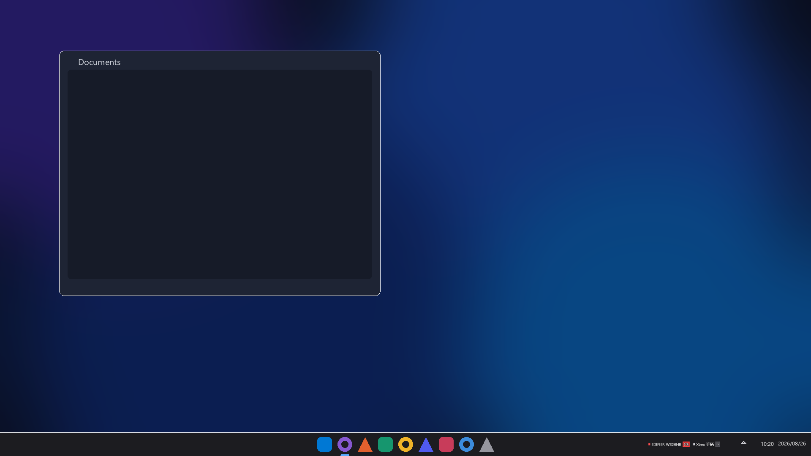

<div align="center">

# ⚡ BtBatteryBar

**任务栏上的设备电量中心 —— 在 Windows 任务栏内直接查看蓝牙 / 2.4G 设备电量**

轻量级原生工具（Rust / Win32 + WinRT GATT + HID），无运行时、无 Electron、无 WebView。

<br>

<a href="https://apps.microsoft.com/detail/9P6547H7G37P?mode=direct">
  
</a>

<br>

[](https://apps.microsoft.com/detail/9P6547H7G37P)
[](https://github.com/Lawrence7y/bt-battery-bar/releases)
[](#-支持的设备与协议)
[](https://rustup.rs)
[](LICENSE)
[](https://github.com/Lawrence7y/bt-battery-bar/stargazers)
[](#-特性一览)
[](#-特性一览)

</div>

---

## 📖 项目简介

**BtBatteryBar** 在**任务栏内部、紧挨右下角时钟/通知区域左侧**常驻一条迷你电量条，直接显示已连接的蓝牙和 2.4G 键鼠、耳机、手柄等设备的剩余电量；同时提供系统托盘图标与右键菜单。

它解决一个简单却高频的痛点：**无线设备总在你最需要的时候没电**。有了它，电量信息始终在视野角落，鼠标没电再也不用等到会议中途。

- 单文件原生二进制，体积约 **0.4 MB**
- 常驻内存实测约 **23–24 MB 工作集 / 约 5 MB 私有内存**（2560x1440@150%、7 台蓝牙+2.4G 设备在线时测得），轮询为稀疏短进程级操作，无 WebView
- 读取走 Windows GATT **电池服务 (0x180F / 0x2A19)**、罗技 **HID++**、以及 2.4G 接收器的 HID 厂商报告，纯系统 API，无需额外驱动
- **真正嵌入任务栏**：以 `WS_CHILD + SetParent` 挂到主任务栏 `Shell_TrayWnd` 上，是任务栏的一部分（不是屏幕坐标悬浮覆盖）；自动跟随任务栏位置/尺寸/DPI（Per-Monitor V2；150% 缩放下字号/间距按 1.5× 渲染，已实机验证）
- **Explorer 重启自愈**：任务栏重建后自动重新嵌入，并保留用户原来的显示/隐藏偏好
- **安全降级**：任务栏不存在或 `SetParent` 失败时，退化为独立的**非置顶浮动条**；只有降级模式才启用全屏自动隐藏

## 🖼️ 预览

<div align="center">



*任务栏右下角：EDIFIER 耳机 58% · Xbox 手柄电量（demo 数据）*


*迷你电量条特写：状态圆点 + 设备名 + 电量胶囊*

</div>

## ✨ 特性一览

### 🎯 任务栏内嵌
- 主电量条是任务栏的**真正子窗口**：不会悬浮在全屏视频/游戏之上，也不会被开始菜单等盖住
- 自动跟随任务栏位置与尺寸/DPI（底/顶/左/右、多显示器；Per-Monitor V2，真机 150% 实测）
- **Explorer 重启自愈**：每秒校验窗口父子关系，Explorer 重启或任务栏重建后自动重建窗口并重新嵌入，且保留用户原来的显示/隐藏偏好
- 字号可按 DPI 自动缩放，并提供 小/标准/大/特大 四档手动微调（右键菜单 → 显示 → 字号）
- 固定高对比配色（白字 + 深色描边）在浅色/深色任务栏上都清晰可读，条高与任务栏一致

### 🔌 广泛的设备支持
- **蓝牙设备**：标准 GATT 电池服务（绝大多数 HID-over-GATT 鼠标/键盘/手柄、支持电量上报的耳机）
- **罗技**：HID++ 2.0（Unifying / Lightspeed 接收器、USB 有线）
- **2.4G 接收器**：Compx / ATK 常见协议（report 0x08 / 命令 0x04）
- **EWEADN / Sonix 三模键盘**（前行者 X87 等）：官方驱动同款 0x20 命令（FF60/MI_03 通道，带校验和）
- 全部通过系统 API 读取，**无需安装任何驱动**

### ⚡ 快速且省资源
- **事件驱动**：`DeviceWatcher` 监听蓝牙设备上下线，连接/断开约 1–2 秒内刷新，不等轮询
- **GATT Notify 订阅**：支持推送的设备主动上报电量，数值即时更新，无需扫描
- **带超时的并行扫描**：每台设备的 GATT 读取在独立工作线程上并行进行且单操作 5 秒硬超时，蓝牙栈卡死不会拖垮整体刷新
- **缓存发现**：服务/特征发现走系统缓存，仅电量值真正访问设备（3 次射频往返 → 1 次）
- **轮询线程**仅在扫描时刻做一次 WinRT GATT / HID 枚举，其余时间阻塞等待（`recv_timeout`），不占 CPU
- 原生 Win32 消息循环 + GDI 绘制，图标运行时逐像素绘制，不内嵌资源文件

### 🔔 贴心功能
- **低电量提醒**：电量 ≤ 20% 时托盘气泡提醒（同一设备每 30 分钟最多一次）
- **溢出面板**：设备过多超出任务栏宽度时显示 `+n` 胶囊，点击弹出完整设备列表
- **全屏自动隐藏（仅降级浮动条）**：检测到前台全屏窗口（全屏视频 / 游戏）时自动隐藏浮动条，退出全屏立即恢复
- **开机自启**：一键写入 HKCU Run，随系统启动

## 🛒 安装

### 方式一：Microsoft Store（推荐）⭐

BtBatteryBar 已上架 Microsoft Store，点击下方徽章或搜索「**BtBatteryBar**」安装：

<a href="https://apps.microsoft.com/detail/9P6547H7G37P?mode=direct">
  
</a>

商店版优势：微软重新签名、自动更新、可从「设置 → 应用」干净卸载。

### 方式二：GitHub 下载

前往 [Releases](https://github.com/Lawrence7y/bt-battery-bar/releases) 页面：

- **图形安装包**（推荐）：下载 `BtBatteryBar-Setup.exe` 双击即可，纯 GUI 无命令行黑框，无需管理员权限；安装到 `%LOCALAPPDATA%\BtBatteryBar`，可勾选开机自启与安装后启动；支持静默参数 `/S`
- **便携版**：下载 `bt-battery-bar.exe` 直接双击运行即可

### 运行后

1. 任务栏右侧出现迷你电量条，托盘出现电池图标。
2. 迷你条 **左键单击 = 立即刷新**，**右键 = 菜单**。
3. 托盘图标：**左键 = 显示/隐藏迷你条**，**右键 = 菜单**。

> 💡 首次使用请先到 **设置 → 蓝牙和其他设备** 配对蓝牙键鼠/手柄，配对后才会出现在电量条上。

## 📋 菜单项

| 菜单 | 说明 |
|---|---|
| 显示/隐藏电量条 | 开关任务栏内嵌迷你条 |
| 字号 | 小 / 标准 / 大 / 特大（默认「标准」；150% 缩放下字体约 19.5px，觉得大就选「小」） |
| 立即刷新 | 立刻扫描一次 |
| 轮询间隔 | 10 秒 / 30 秒 / 1 分钟 / 5 分钟（无设备连接时自动按 15s 扫描以便及时发现新连接；蓝牙设备上下线由系统事件即时触发刷新） |
| 开机自启 | 写入 HKCU Run，随系统启动 |
| 低电量提醒 | 电量 ≤ 20% 时托盘气泡提醒（同一设备每 30 分钟最多一次） |

## 🎨 迷你条样式

- 固定高对比配色（白字 + 深色描边，胶囊按电量着色），高度与任务栏一致，嵌在通知区域左侧。
- 每个设备：**状态圆点 + 设备名 + 电量胶囊**。
- 圆点：🟢 绿 = 已连接，🔴 红 = 低电量(≤20%)，⚪ 灰 = 离线。
- 胶囊：🟢 绿 ≥50%，🟠 橙 20–49%，🔴 红 <20%，⚪ 灰 `--` = 该设备未开放电池服务。

## 🔌 支持的设备与协议

| 设备类型 | 读取方式 | 说明 |
|---|---|---|
| 蓝牙鼠标 / 键盘 / 手柄 | GATT 电池服务 (0x180F / 0x2A19) | 需先在系统设置中配对 |
| 蓝牙耳机 | GATT 电池服务 | 需设备暴露电池服务 |
| 罗技（Unifying / Lightspeed / USB 有线） | HID++ 2.0 特征查询 | Unified Battery / Battery Status / Battery Level Status |
| Compx / ATK 2.4G 接收器 | HID 厂商报告 | report 0x08 / 命令 0x04 |
| EWEADN / Sonix 三模键盘（前行者 X87 等） | 0x20 命令（FF60/MI_03） | 官方驱动同款协议，带校验和；dongle 心跳中的冻结电量字段已识别并忽略 |

## 🔧 工作原理

### 任务栏嵌入

- 主电量条窗口启动后通过 `SetWindowLongPtrW` 把样式从 `WS_POPUP` 切换为 `WS_CHILD`，移除 `WS_EX_TOPMOST`，然后 `SetParent` 到主任务栏 `Shell_TrayWnd`，并用 `SetWindowPos` 以**任务栏客户区坐标**定位在通知区域（`TrayNotifyWnd`）左侧。因此它是任务栏的真正子窗口：不会悬浮在全屏视频/游戏之上，也不会被开始菜单等盖住。
- 程序不使用 AppBar 接口，也不会改变 Explorer 自有子窗口的大小或布局。
- 自愈机制：每秒定时器都会执行嵌入自愈（无论数据是否变化、条是否被隐藏），检查当前 `Shell_TrayWnd` 与 `GetParent`；显示/隐藏只由统一的可见性决策（用户偏好 × 全屏抑制）决定，因此**用户手动隐藏的条在嵌入、自愈、重建后始终保持隐藏**。
- 隐藏的顶层 helper 窗口（非置顶、不激活、`WS_EX_TOOLWINDOW`、从不 `ShowWindow`）同时承担两个职责：作为 `RIDEV_INPUTSINK` 原始输入接收器，以及接收 `TaskbarCreated` / `WM_DISPLAYCHANGE` / `WM_SETTINGCHANGE` 广播并转发给主条（内嵌的 `WS_CHILD` 子窗口和 `HWND_MESSAGE` 消息窗口都收不到这些广播）。
- **Explorer 重启 / 任务栏重建后的自动重建**：`WM_CLOSE` 与菜单"退出"先设置主动退出标志再销毁窗口；若主条销毁时仍处于内嵌状态且并非主动退出，则判定为 Explorer 意外销毁并调度重建。重建通过向 helper 窗口 `PostMessageW(MSG_RECREATE_STRIP)` 触发；单次失败时由 helper 的 `SetTimer` 定时重试，绝不阻塞 UI 线程。重建成功后按用户偏好恢复显示/隐藏、重新注册托盘图标、清零溢出点击区，并关闭可能残留在屏幕上的溢出面板。
- 仅当任务栏不存在或 `SetParent` 失败时才降级为独立的非置顶浮动条（`WS_POPUP`，无 TopMost）；只有降级模式启用全屏自动隐藏。溢出设备面板是独立的 popup 窗口，不属于任务栏。

### 性能与实时性

见 [⚡ 快速且省资源](#-快速且省资源)：事件驱动 + GATT Notify + 带超时的并行扫描 + 缓存发现，配合稀疏轮询与自适应间隔（有设备按设定间隔，无连接按 15s），兼顾实时性与功耗。

## 🛠️ 命令行

```
bt-battery-bar.exe            正常启动
bt-battery-bar.exe demo       用示例数据预览界面（方便调试外观）
bt-battery-bar.exe probe      枚举一次已配对蓝牙设备并输出 JSON（调试）
bt-battery-bar.exe hidprobe   枚举 HID/2.4G 接收器并尝试读电量（调试）
bt-battery-bar.exe via        枚举 QMK VIA (FF60) 命令空间（调试）
bt-battery-bar.exe hidscan    暴力扫描 dongle 已知命令（调试）
bt-battery-bar.exe scan2      暴力扫描 FF59 命令空间，标记异于心跳的响应（调试）
bt-battery-bar.exe feat       探测 HidD_GetFeature 特征报告（调试）
```

`probe` 输出示例：

```json
[ { "name": "EDIFIER W820NB 双金标版", "connected": false, "battery": null, "status": "offline", "kind": "Headset", ... } ]
```

## 📦 从源码构建

环境：Windows 10/11 x64 + [Rust](https://rustup.rs)（MSVC target，edition 2024 需 1.85+）+ VS2022 Build Tools。

```bash
cd bt-battery-bar
cargo build --release
# 产出: target\release\bt-battery-bar.exe
```

## ⚠️ 已知限制

- **2.4G 接收器**：键鼠通过 USB 接收器连接时，Windows 会独占键盘/鼠标 HID 集合。程序改为打开厂商集合（hidapi 方式：R/W + overlapped，失败再以 access=0 打开）读取电量。少数品牌只用私有协议且未适配时，2.4G 设备会显示为已连接但电量为 `--`。
- 需要先到 设置→蓝牙和其他设备 里**配对**蓝牙键鼠/手柄，配对后才会出现在电量条上。
- 电量依赖设备本身提供 GATT 电池服务：绝大多数新款 HID-over-GATT 鼠标/键盘/手柄、以及支持电量上报的耳机可用；少数旧款 BR/EDR 外设不暴露电量，会显示为 `--`（离线同样显示 `--`）。
- 设备需处于配对状态；查询仅对已连接设备发起 GATT 读取（离线设备只列出、不读取），节省电量与流量。
- 仅 Windows 10/11 x64（WinRT/Bluetooth API 需要）。

## 🔒 隐私

本程序**完全本地运行**：不收集、不上传任何数据，无遥测、无网络通信。仅通过系统 API 读取已配对设备的电量用于屏幕显示。详见 [PRIVACY.md](PRIVACY.md)。

## 📄 许可证

[MIT](LICENSE) © Lawrence7YY
